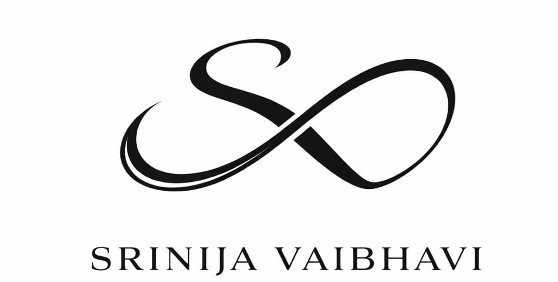

<!-- BRANDING LOGO -->

  

<!-- ANIMATION HEADER -->

  

---

<!-- THE DASHBOARD GRID -->
<table border="0" width="100%">
  <tr>
    <!-- LEFT COLUMN: ABOUT ME -->
    <td width="55%" valign="top">
      <h2>🚀 About Me</h2>
      
I am a <b>developer at heart</b> driven by a singular mission: building production-ready AI applications and practical tools that real users love interacting with.

      
I blend deep frontend expertise with robust backend infrastructures, cloud architecture, and modern AI orchestration. I love <b>"vibe coding" with advanced AI tools</b> to rapidly prototype, iterate at lightning speed, and push the boundaries of what a single developer can build.

      <ul>
        <li>🧠 <b>AI Strengths:</b> Building production RAG systems, designing multi-agent workflows, and fine-tuning prompt engineering.</li>
        <li>☁️ <b>Cloud & Systems:</b> Designing highly scalable, fault-tolerant infrastructures across both AWS and Azure ecosystems.</li>
        <li>🛠️ <b>Product Mindset:</b> Solving real-world problems with highly responsive, intuitive user interfaces.</li>
      </ul>
    </td>
    <!-- RIGHT COLUMN: LIVE METRICS & VERIFIED CREDENTIALS -->
    <td width="45%" valign="top" align="center">
      <h3>🏅 Cloud Credentials</h3>
      

        <!-- AWS SAP Badge -->
        
         
        <!-- AWS DVA Badge -->
        
         
        <!-- Azure AI Engineer Badge -->
        
      

       
      
    </td>
  </tr>
</table>

---

## 🛠️ Comprehensive Tech Stack

### 🧠 Artificial Intelligence & Agentic Frameworks

  <a href="https://skillicons.dev">
    <!-- Using custom visual grouping for AI/ML/Agents -->
    
  </a>

<!-- Markdown Badges for Specific Agentic/AI Tools -->

### 🌐 Frontend & User Interfaces

  

### ⚙️ Backend & Databases

  

### ☁️ Cloud & DevOps Infrastructure

  

---

## 📊 Performance & Commit Insights

<table border="0" width="100%">
  <tr>
    <td width="50%" valign="top">
      <h4>💡 Language Breakdown</h4>
      
    </td>
    <td width="50%" valign="top">
      <h4>🔥 Contribution Streak</h4>
      
    </td>
  </tr>
</table>

### 🌊 Development Velocity

  

---

<!-- FOOTER -->

  
👨‍💻 <i>"Let's build something intelligent today."</i>

