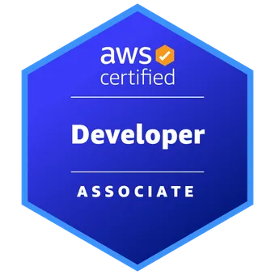

  

  

&nbsp;

---

&nbsp;

<table border="0">
  <tr>
    <td width="550" valign="top">
      <h2>Who I Am</h2>
      
I am a <b>Software Engineer with 3+ years of experience</b> building robust, end-to-end full-stack applications. Over the past year and a half, I have dedicated my focus to the cutting-edge frontier of AI—architecting <b>intelligent AI applications and autonomous agents</b> designed both to power high-impact, client-facing experiences and to radically optimize internal workflows and workforce productivity.

      <h2>Beyond the Code</h2>
      <ul>
        <li><b>Tech & Startups:</b> Permanently plugged into the latest tech breakthroughs. I have a deep fascination with unique, early-stage startups and analyzing the disruptive ideas shaping tomorrow's industries.</li>
        <li><b>Current Deep Dives:</b> Actively expanding my engineering horizons into quantitative development, algorithmic trading models, and high-frequency financial systems.</li>
        <li><b>The Ultimate Enthusiast of:</b> A brilliant thriller or detective movie. If there is an intricate mystery, a brilliant puzzle, or a complex investigation to unravel, I am completely hooked.</li>
        <li><b>Food & Exploration:</b> A passionate local restaurant reviewer and culinary explorer—always on the hunt for unique dining concepts and exceptional flavor profiles.</li>
      </ul>
    </td>
    <td width="350" valign="top" align="center">
      <h3>🏅 Cloud Credentials</h3>
      
        
      
        
      
        
    </td>
  </tr>
</table>

## 🛠️ Comprehensive Tech Stack

### 🧠 Artificial Intelligence & Agentic Frameworks

  

### 🌐 Frontend & User Interfaces

  

### ⚙️ Backend & Databases

  

### ☁️ Cloud & DevOps Infrastructure

  

---

  
👨‍💻 <i>"Let's build something intelligent today."</i>

